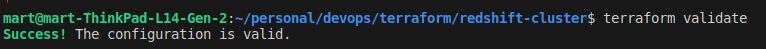
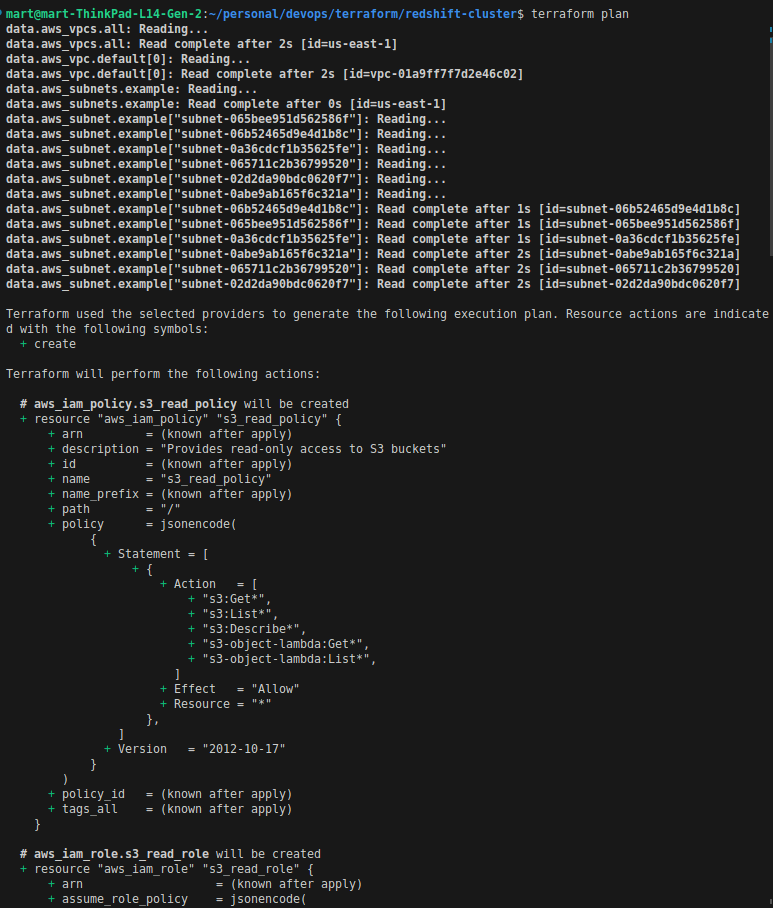
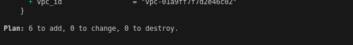
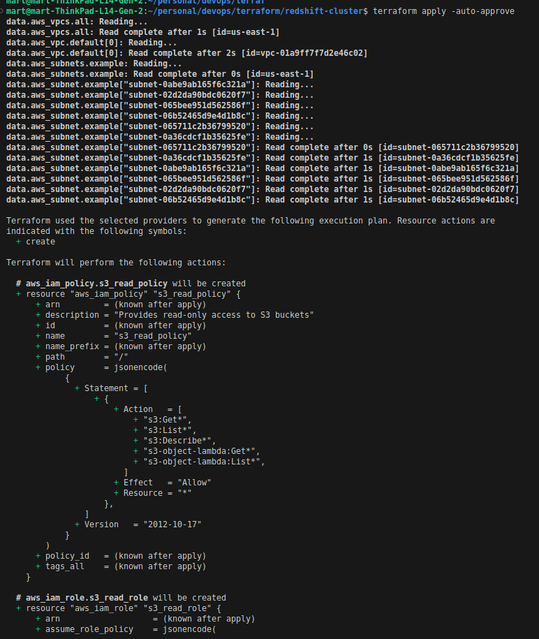
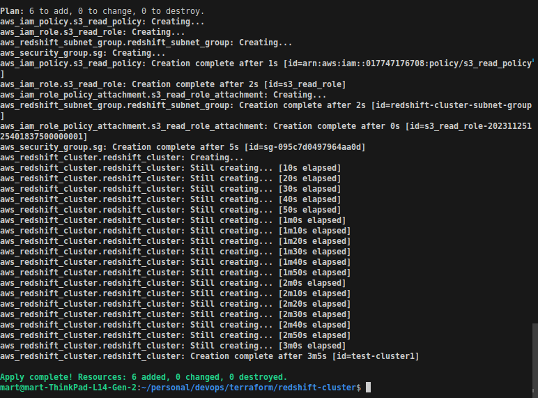
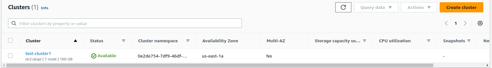
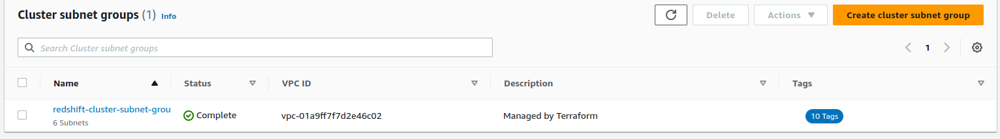
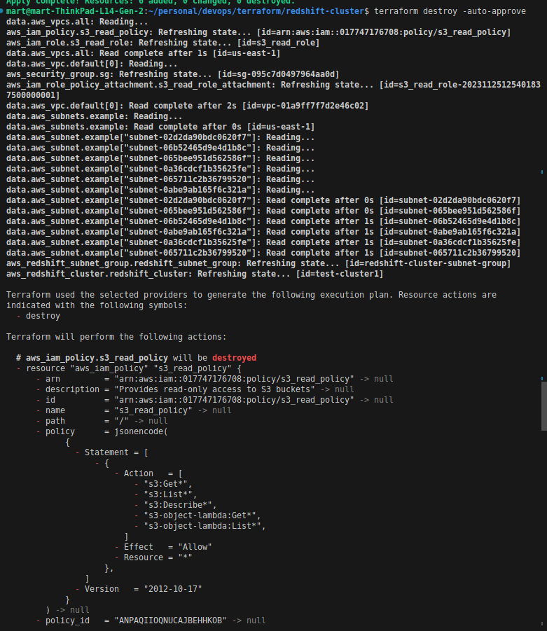
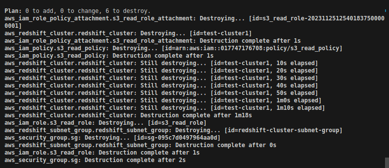

## Installation
To install terraform on your machine, follow the [Installation guide](https://developer.hashicorp.com/terraform/tutorials/aws-get-started/install-cli) on hashicorp website

## Project setup 
Once the setup is complete, go head and clone the repo to your machine. 

## Steps
1. cd into the repo and run terraform init: The command initializes a working directory containing Terraform configuration files. This is the first command that should be run after writing a new Terraform configuration or cloning an existing one from version control.
```
cd iac-terraform/redshift-cluster/
terraform init
```
2. create a terraform.tfvars and add the values below. This is the file you'll use to initiaie your variables


## Tfvars
```
cluster_data_encryption            = ""
cluster_enhanced_vpc_routing       = false
cluster_publicly_accessible        = ""
cluster_subnet_group_name          = ""
cluster_type                       = ""
database_name                      = ""
final_snapshot                     = ""
master_password                    = ""
master_username                    = ""
node_type                          = ""
number_of_nodes                    = ""
project                            = ""
redshift_cluster_identifier        = ""
redshift_cluster_port              = ""
redshift_subnet_group_name         = ""
region                             = ""
s3_policy_name                     = ""
s3_read_policy_description         = ""
s3_read_policy_name                = ""
s3_read_role_name                  = ""
security_group_description         = ""
security_group_ingress_description = ""
security_group_name                = ""
tags                               = {}
```

3. Run validate command: this is used to verify the correctness of Terraform configuration files. It checks the syntax of the Terraform files, ensures the correct usage of attributes and values, and validates the configuration based on the core syntax of Terraform and also by checking all the providers in the code.

```
terraform validate
```

4. Run terraform plan: this command creates an execution plan, which lets you preview the changes that Terraform plans to make to your infrastructure. By default, when Terraform creates a plan it:

- Reads the current state of any already-existing remote objects to make sure that the Terraform state is up-to-date.
- Compares the current configuration to the prior state and noting any differences.
- Proposes a set of change actions that should, if applied, make the remote objects match the configuration.
```
terraform plan
```



5. Terraform apply: this command executes the actions proposed in a Terraform plan. Terraform will request for your approval before it can create the resources in your preferred cloud computing provider. Alternatively, you can pass the -auto-approve flag which skips the approval step.
```
terraform apply -auto-approve
```





6. Terraform destroy: this command destroys all remote objects managed by a particular Terraform configuration.




## Requirements

| Name | Version |
|------|---------|
| <a name="requirement_aws"></a> [aws](#requirement\_aws) | 5.26.0 |

## Providers

| Name | Version |
|------|---------|
| <a name="provider_aws"></a> [aws](#provider\_aws) | 5.26.0 |

## Modules

No modules.

## Resources

| Name | Type |
|------|------|
| [aws_iam_policy.s3_read_policy](https://registry.terraform.io/providers/hashicorp/aws/5.26.0/docs/resources/iam_policy) | resource |
| [aws_iam_role.s3_read_role](https://registry.terraform.io/providers/hashicorp/aws/5.26.0/docs/resources/iam_role) | resource |
| [aws_iam_role_policy_attachment.s3_read_role_attachment](https://registry.terraform.io/providers/hashicorp/aws/5.26.0/docs/resources/iam_role_policy_attachment) | resource |
| [aws_redshift_cluster.redshift_cluster](https://registry.terraform.io/providers/hashicorp/aws/5.26.0/docs/resources/redshift_cluster) | resource |
| [aws_redshift_subnet_group.redshift_subnet_group](https://registry.terraform.io/providers/hashicorp/aws/5.26.0/docs/resources/redshift_subnet_group) | resource |
| [aws_security_group.sg](https://registry.terraform.io/providers/hashicorp/aws/5.26.0/docs/resources/security_group) | resource |
| [aws_subnet.example](https://registry.terraform.io/providers/hashicorp/aws/5.26.0/docs/data-sources/subnet) | data source |
| [aws_subnets.example](https://registry.terraform.io/providers/hashicorp/aws/5.26.0/docs/data-sources/subnets) | data source |
| [aws_vpc.default](https://registry.terraform.io/providers/hashicorp/aws/5.26.0/docs/data-sources/vpc) | data source |
| [aws_vpcs.all](https://registry.terraform.io/providers/hashicorp/aws/5.26.0/docs/data-sources/vpcs) | data source |

## Inputs

| Name | Description | Type | Default | Required |
|------|-------------|------|---------|:--------:|
| <a name="input_cluster_data_encryption"></a> [cluster\_data\_encryption](#input\_cluster\_data\_encryption) | Data encryption | `bool` | n/a | yes |
| <a name="input_cluster_enhanced_vpc_routing"></a> [cluster\_enhanced\_vpc\_routing](#input\_cluster\_enhanced\_vpc\_routing) | Enhanced vpc routing | `bool` | `false` | no |
| <a name="input_cluster_publicly_accessible"></a> [cluster\_publicly\_accessible](#input\_cluster\_publicly\_accessible) | Cluster public accessibility | `bool` | n/a | yes |
| <a name="input_cluster_subnet_group_name"></a> [cluster\_subnet\_group\_name](#input\_cluster\_subnet\_group\_name) | Cluster subnet group name | `string` | `""` | no |
| <a name="input_cluster_type"></a> [cluster\_type](#input\_cluster\_type) | cluster type | `string` | `""` | no |
| <a name="input_database_name"></a> [database\_name](#input\_database\_name) | database name | `string` | `""` | no |
| <a name="input_final_snapshot"></a> [final\_snapshot](#input\_final\_snapshot) | Final snapshot | `bool` | `""` | no |
| <a name="input_master_password"></a> [master\_password](#input\_master\_password) | Master password | `string` | n/a | yes |
| <a name="input_master_username"></a> [master\_username](#input\_master\_username) | Master usename | `string` | n/a | yes |
| <a name="input_node_type"></a> [node\_type](#input\_node\_type) | node type | `string` | n/a | yes |
| <a name="input_number_of_nodes"></a> [number\_of\_nodes](#input\_number\_of\_nodes) | Cluster subnet group name | `number` | n/a | yes |
| <a name="input_project"></a> [project](#input\_project) | Project name | `string` | n/a | yes |
| <a name="input_redshift_cluster_identifier"></a> [redshift\_cluster\_identifier](#input\_redshift\_cluster\_identifier) | Redshift cluster identifier - This is a required field, and must be a lower case string. | `string` | n/a | yes |
| <a name="input_redshift_cluster_port"></a> [redshift\_cluster\_port](#input\_redshift\_cluster\_port) | Cluster port | `number` | n/a | yes |
| <a name="input_redshift_subnet_group_name"></a> [redshift\_subnet\_group\_name](#input\_redshift\_subnet\_group\_name) | Redshift subnet group name | `string` | n/a | yes |
| <a name="input_region"></a> [region](#input\_region) | Region to deploy resources in | `string` | n/a | yes |
| <a name="input_s3_policy_name"></a> [s3\_policy\_name](#input\_s3\_policy\_name) | S3 read only access policy | `string` | n/a | yes |
| <a name="input_s3_read_policy_description"></a> [s3\_read\_policy\_description](#input\_s3\_read\_policy\_description) | S3 read policy description | `string` | n/a | yes |
| <a name="input_s3_read_policy_name"></a> [s3\_read\_policy\_name](#input\_s3\_read\_policy\_name) | S3 read policy name | `string` | n/a | yes |
| <a name="input_s3_read_role_name"></a> [s3\_read\_role\_name](#input\_s3\_read\_role\_name) | S3 read role name | `string` | n/a | yes |
| <a name="input_security_group_description"></a> [security\_group\_description](#input\_security\_group\_description) | Security group description | `string` | n/a | yes |
| <a name="input_security_group_ingress_description"></a> [security\_group\_ingress\_description](#input\_security\_group\_ingress\_description) | Security group ingres description | `string` | n/a | yes |
| <a name="input_security_group_name"></a> [security\_group\_name](#input\_security\_group\_name) | Security group name | `string` | n/a | yes |     
| <a name="input_tags"></a> [tags](#input\_tags) | Tags to be used in the project | `map(any)` | `{}` | no |

## Outputs

No outputs.

## References
- [Terraform aws provider](https://registry.terraform.io/providers/hashicorp/aws/latest/docs)   
- [Install Terraform](https://developer.hashicorp.com/terraform/tutorials/aws-get-started/install-cli)   
- [Terraform docs](https://terraform-docs.io/user-guide/introduction/)   
- [AWS redshift cluster](https://registry.terraform.io/providers/hashicorp/aws/latest/docs/resources/redshift_cluster)   
- [Amazon Redshift docs](https://docs.aws.amazon.com/redshift/latest/gsg/getting-started.html)       